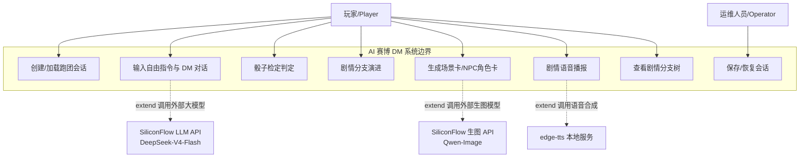
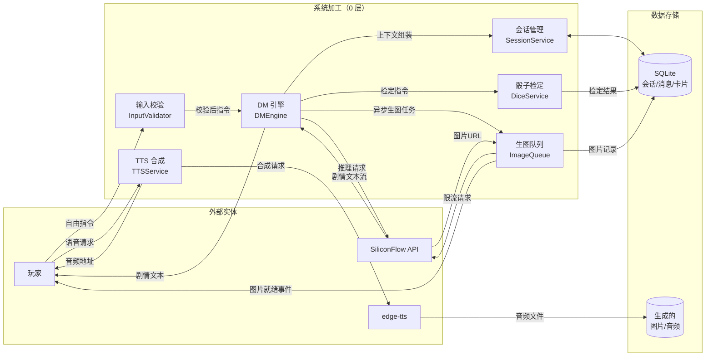
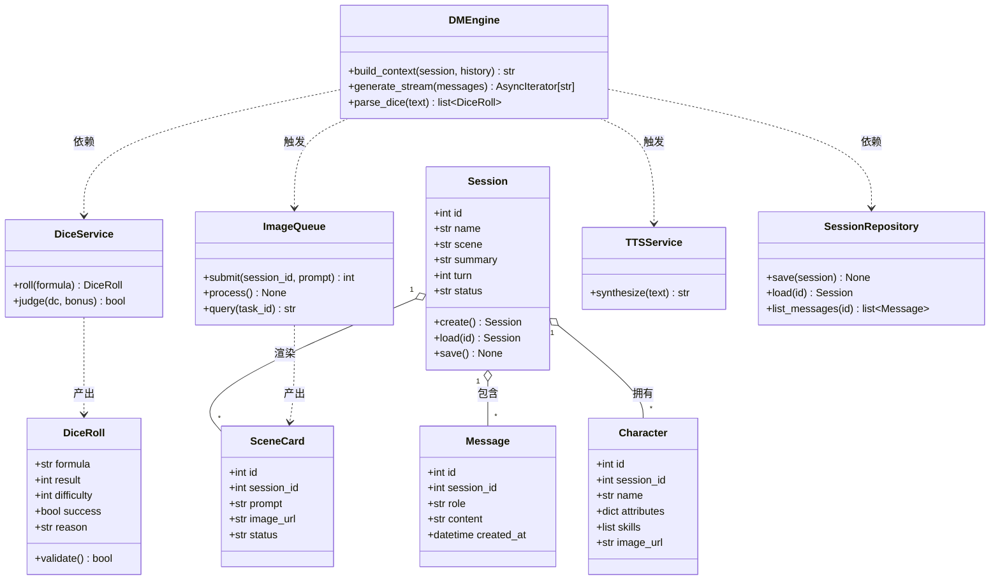
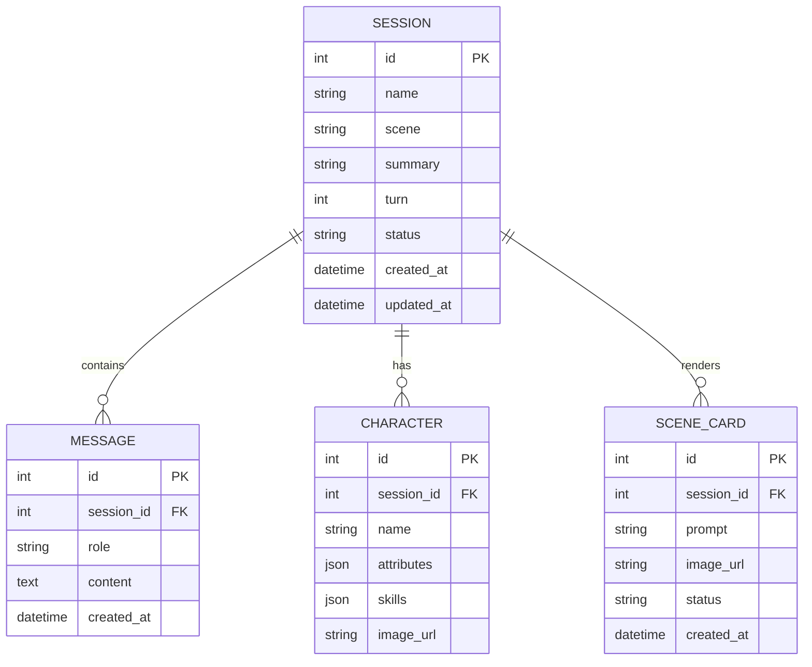
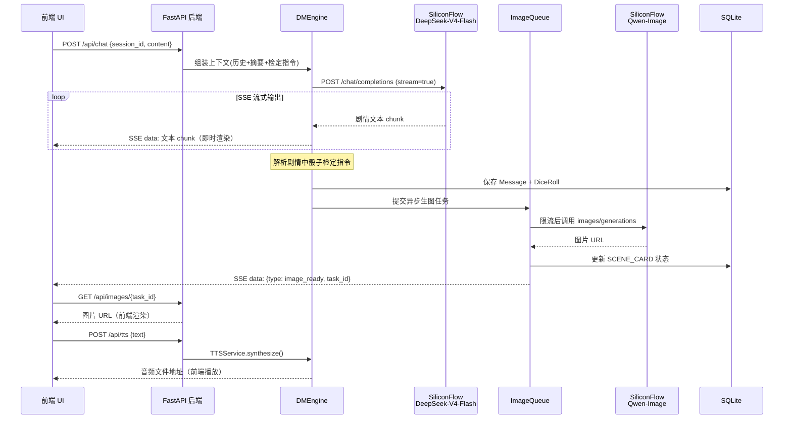
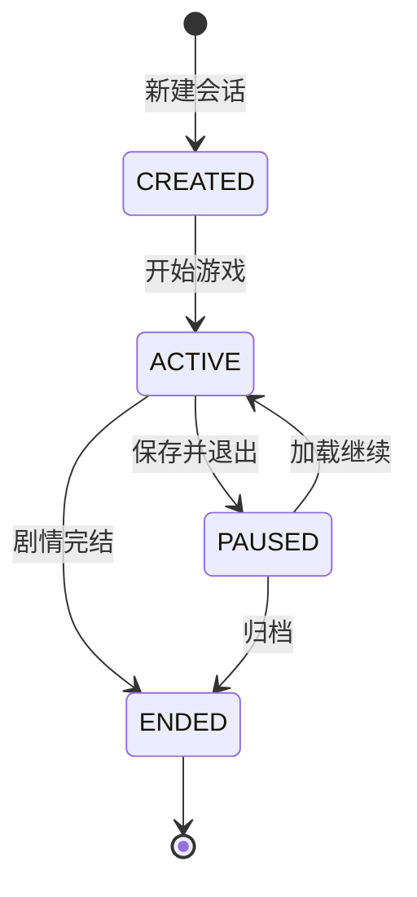
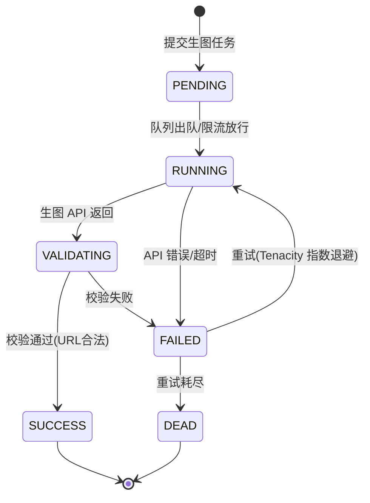

# AI 赛博 DM 与无限跑团引擎 — 系统设计文档

> 版本：v0.1（Kick-off 初版）｜ 更新：2026-08-29
> 对应课程：《工程实践（基于敏捷方法的 AI 原生应用开发实践）》Sprint 1 交付物

---

## 1. 项目概述

**选题**：AI 赛博 DM 与无限跑团 / 剧本杀引擎（AI-DM & Immersive RPG Engine）

利用 `DeepSeek-V4-Flash` 的逻辑推理能力，由 AI 扮演跑团 / 剧本杀主持人（DM）。系统实时判决玩家输入的自由指令、判定随机骰子检定、演进剧情分支，并调用生图 API 渲染场景卡片与 NPC 角色画像，配合微软 `edge-tts` 实现语音播报。

**三大核心技术难点**：
1. 多轮对话上下文记忆管理
2. Pydantic 结构化数值检定
3. SSE 流式文本与生图异步同步

**技术栈**：Python 3.11 + FastAPI + SQLite + 原生前端（HTML/CSS/JS）

---

## 2. 技术栈明细

| 层次 | 选型 | 用途 |
|------|------|------|
| 后端框架 | FastAPI + uvicorn | REST API + SSE 流式输出 |
| 数据校验 | Pydantic v2 | 骰子检定结果、DTO 数据契约 |
| 数据库 | SQLite + SQLAlchemy 2.0 | 会话/历史/卡片持久化 |
| LLM | `deepseek-ai/DeepSeek-V4-Flash`（SiliconFlow） | 剧情生成、DM 主持 |
| 生图 | `Qwen/Qwen-Image`（SiliconFlow） | 场景卡 / NPC 角色卡 |
| 语音 | `edge-tts`（微软免费，本地） | 剧情语音播报 |
| 客户端 | openai SDK（OpenAI 兼容格式） | SiliconFlow API 调用 |
| 测试 | Pytest + Behave(Gherkin) | 单元测试 + BDD 验收 |
| 容器化 | Dockerfile + docker-compose | 部署封装 |

---

## 3. 功能模型（Functional Model）

### 3.1 系统顶层用例图（Use Case Diagram）



**Actor 说明**：玩家（主参与者）、运维人员（次要参与者）、外部大模型 API（外部系统）。

### 3.2 系统数据流图（DFD / Level-0）



---

## 4. 数据模型（Data Model）

### 4.1 系统领域类图（Domain Class Diagram）



**关键契约（Pydantic Schema 示例）**：

```python
class DiceRoll(BaseModel):
    """骰子检定数据契约 —— 由 LLM 结构化输出解析"""
    formula: str          # 如 "1d20+3"
    result: int           # 掷骰结果
    difficulty: int       # 难度值 DC
    success: bool         # 是否成功
    reason: str           # 判定理由

class SceneCard(BaseModel):
    """场景卡数据契约"""
    session_id: int
    prompt: str           # 生图英文 Prompt
    image_url: str | None = None
    status: Literal["PENDING", "RUNNING", "VALIDATING", "SUCCESS", "FAILED"]
```

### 4.2 数据库实体关系图（ER Diagram / Schema）



**索引设计**：`MESSAGE(session_id)`、`SCENE_CARD(session_id, status)` 建复合索引以加速会话历史与卡片查询。

---

## 5. 动态 / 行为模型（Dynamic Model）

### 5.1 端到端核心时序图（System Sequence Diagram）



### 5.2 系统生命周期状态机图（State Diagram）

**会话状态机**：



**生图任务状态机**（异步任务 PENDING→RUNNING→VALIDATING→SUCCESS）：



---

## 6. 防御性编程设计（质量防线）

| 风险 | 对策 |
|------|------|
| LLM 输出非结构化 | Pydantic 强校验 + 结构化输出指令 + 失败重试 |
| SiliconFlow 限流(429) | asyncio.Semaphore 限流 + Tenacity 指数退避重试 |
| 生图耗时/排队 | 异步队列 + 前端占位图 + SSE 就绪通知 |
| 上下文超长失忆 | 滑动窗口 + 摘要压缩策略 |
| Prompt 注入 | 系统提示隔离、角色越权指令检测、敏感词过滤 |
| 输入恶意内容 | 输入长度/内容校验、HTML 转义 |
| API Key 泄露 | .env 管理、.env.example 模板、gitignore 排除 |
| 外部 API 不可用 | mock 降级模式（预置剧情/占位图）+ 结构化日志 |

---

## 7. 后续演进（Sprint 3-4）

- 剧情分支树可视化（前端 Mermaid/树形图）
- 场景/角色卡动态渲染与浏览
- 评测数据集 `eval/evalset.json` 与轨迹评分脚本
- Docker 容器化一键启动
