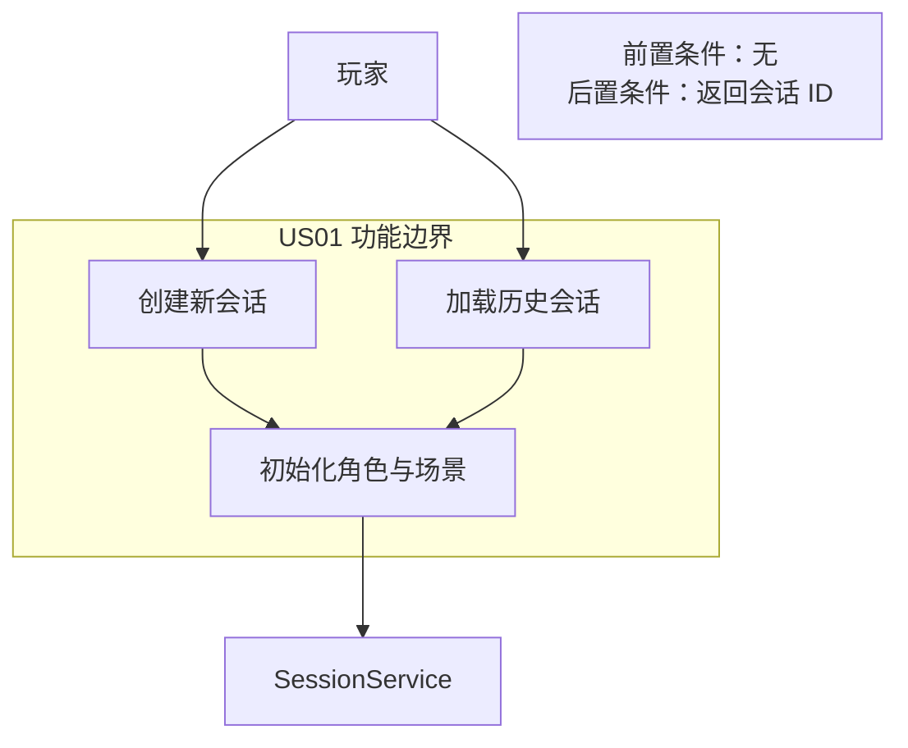
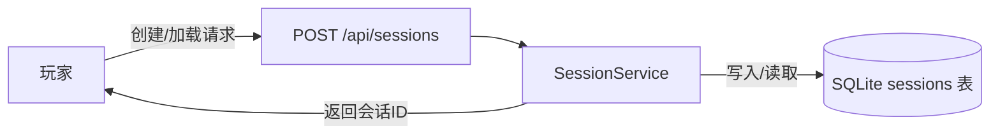
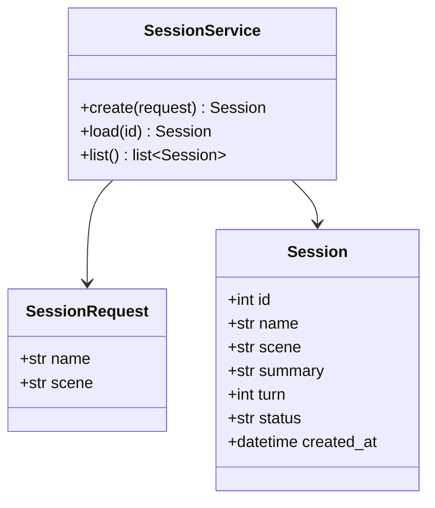
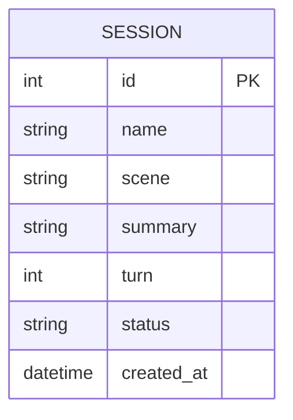
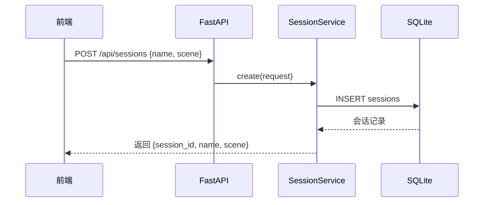
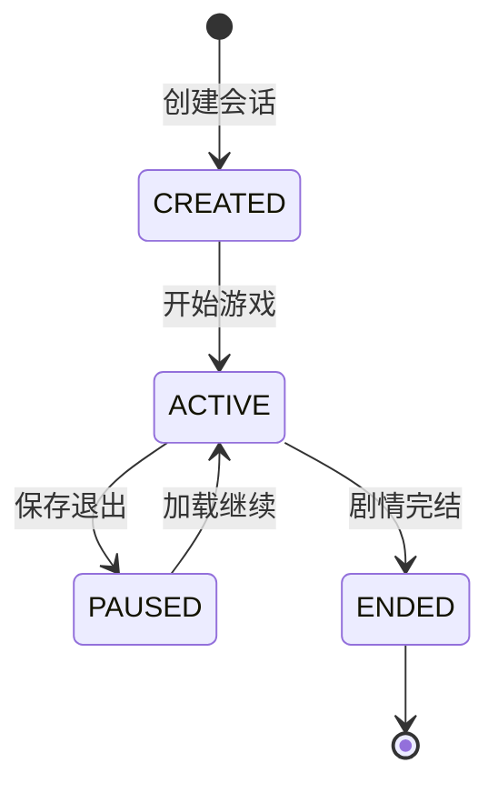

# US01 创建与加载跑团会话

优先级：P0 ｜ 故事点：3 ｜ 对应 Sprint 2

## Card

- **As a**：跑团玩家
- **I want**：新建或加载一个跑团会话
- **So that**：能开始游戏或继续之前的冒险

## Conversation

- 前置条件：无
- 描述：玩家输入会话名称并选择场景主题（如"赛博朋克"），系统创建会话并初始化角色；或从历史会话列表选择加载
- 验收：能创建会话、能加载历史会话、会话有唯一标识

## Confirmation

```gherkin
Feature: 创建与加载会话
  Scenario: 新建会话
    Given 玩家未进入任何会话
    When 玩家创建会话"赛博酒馆"，主题"赛博朋克"
    Then 系统创建会话并返回会话 ID
  Scenario: 加载会话
    Given 玩家有历史会话
    When 玩家选择历史会话并进入
    Then 系统加载该会话的剧情与角色状态
```

---

## 故事级 6 图

### 图 1：用例 / 边界图（Story Context & Scope）



### 图 2：组件 / 数据流图（Story Component / Data Flow）



### 图 3：领域类与数据契约图（Pydantic Schema）



### 图 4：数据实体关系 / 持久化模型（Story Data Entity）



### 图 5：端到端时序图（Story Sequence Diagram）



### 图 6：微观状态机与活动流程图（Story State Machine）


