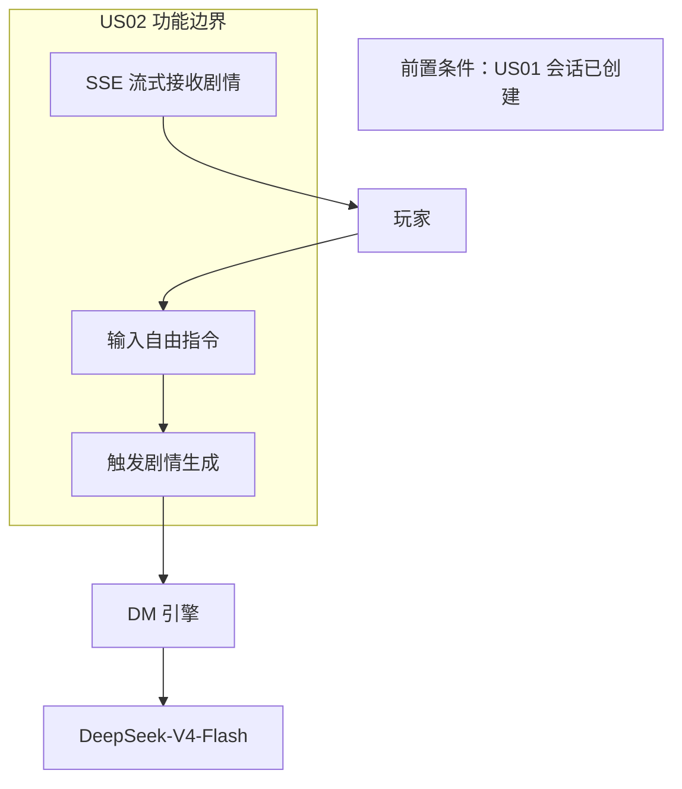
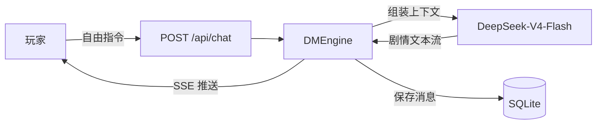
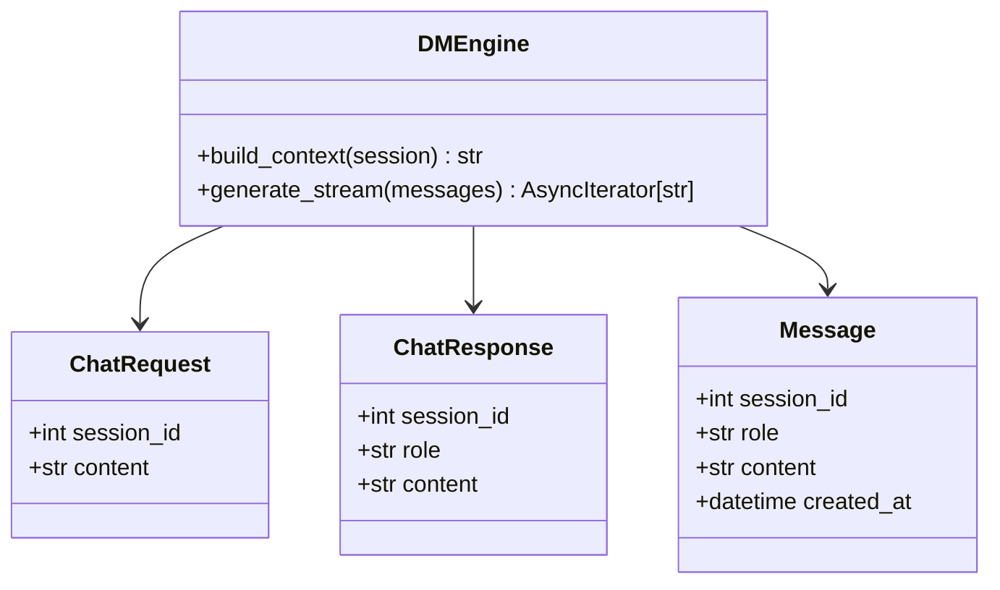
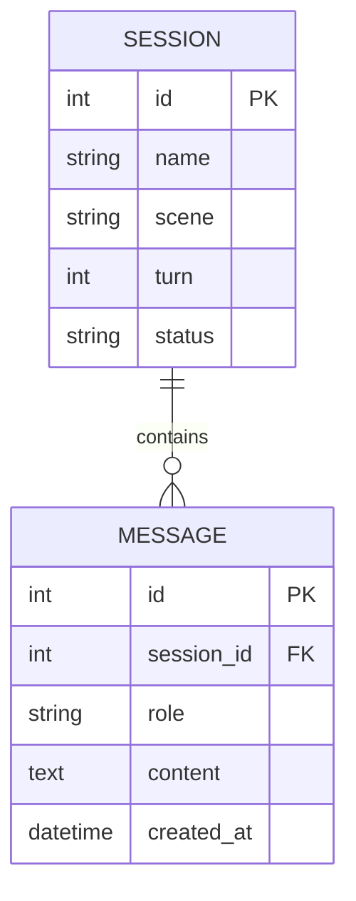
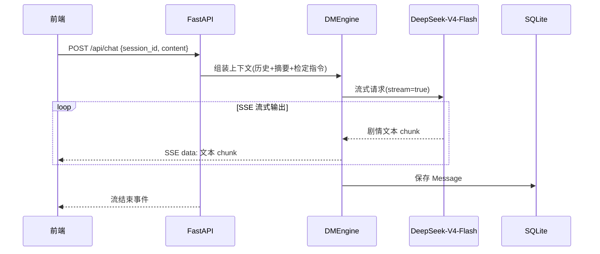
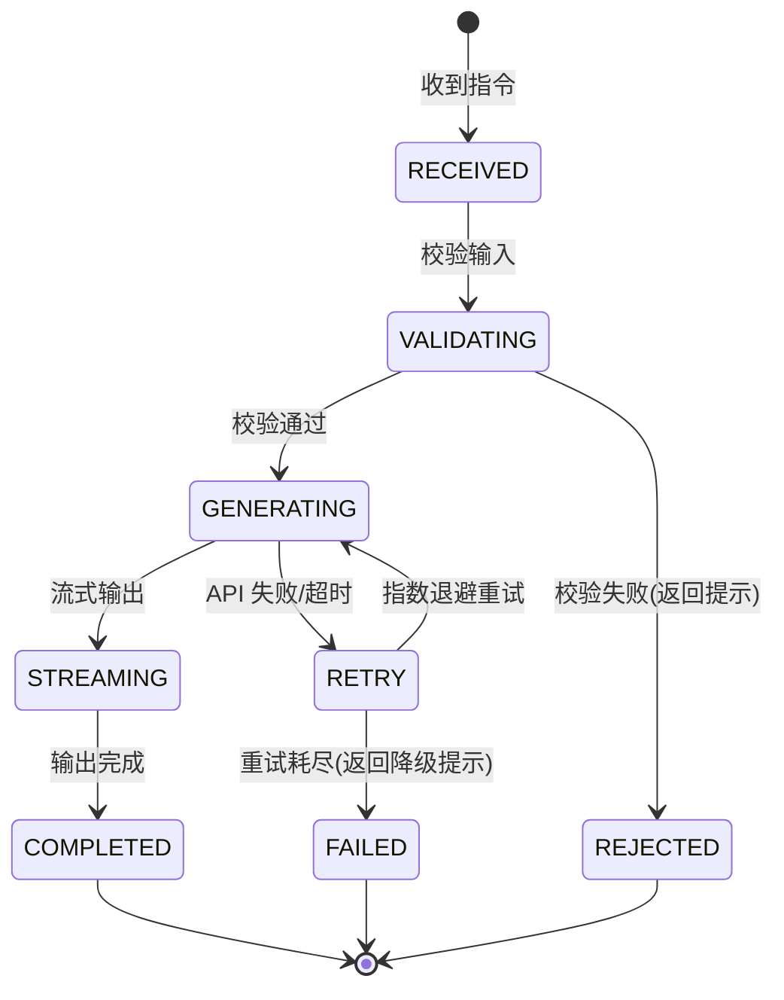

# US02 玩家指令触发 DM 剧情生成

> 核心用户故事（含 6 图建模）｜ 优先级：P0 ｜ 故事点：5 ｜ 对应 Sprint 2

---

## Card（卡片）

- **用户角色（As a）**：跑团玩家
- **需求（I want）**：输入任意自由指令
- **价值（So that）**：DM 实时生成剧情、推进冒险，体验"自由行动"的跑团乐趣

## Conversation（对话）

- **前置条件**：玩家已创建/加载会话（US01），会话状态正常
- **故事描述**：玩家在对话界面输入自由指令（如"我撬开那扇门"），系统调用 DeepSeek-V4-Flash 生成剧情回应，通过 SSE 流式推送给前端展示；剧情与历史上下文衔接
- **验收标准**：
  1. 输入指令后 3 秒内开始流式返回剧情
  2. 剧情内容连贯，引用历史上下文
  3. 支持 SSE 流式"打字机"效果
  4. 空指令/超长指令被拦截并提示

## Confirmation（Gherkin BDD）

```gherkin
Feature: 玩家指令触发 DM 剧情生成
  Scenario: 玩家输入自由指令，DM 生成剧情
    Given 玩家已进入会话"赛博酒馆"
    When 玩家输入"我走向吧台，问老板最近有什么传闻"
    Then 系统调用大模型生成剧情回应
    And 剧情文本通过 SSE 流式返回
    And 前端展示完整剧情内容

  Scenario: 输入为空或超长
    Given 玩家在会话中
    When 玩家输入空白或超过 500 字的指令
    Then 系统返回输入错误提示
    And 不调用大模型
```

---

## 故事级 6 图

### 图 1：用例 / 边界图（Story Context & Scope）



### 图 2：组件 / 数据流图（Story Component / Data Flow）



### 图 3：领域类与数据契约图（Pydantic Schema）



### 图 4：数据实体关系 / 持久化模型（Story Data Entity）



### 图 5：端到端时序图（Story Sequence Diagram）



### 图 6：微观状态机与活动流程图（Story State Machine）


