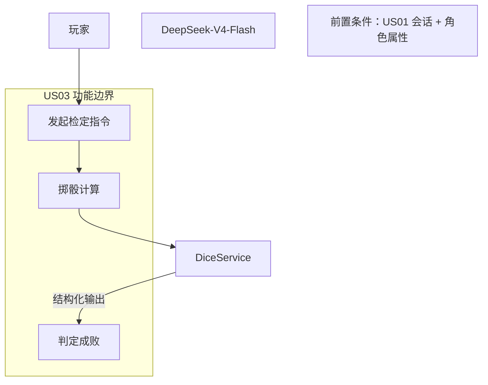
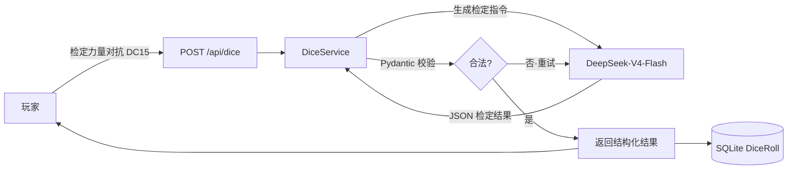
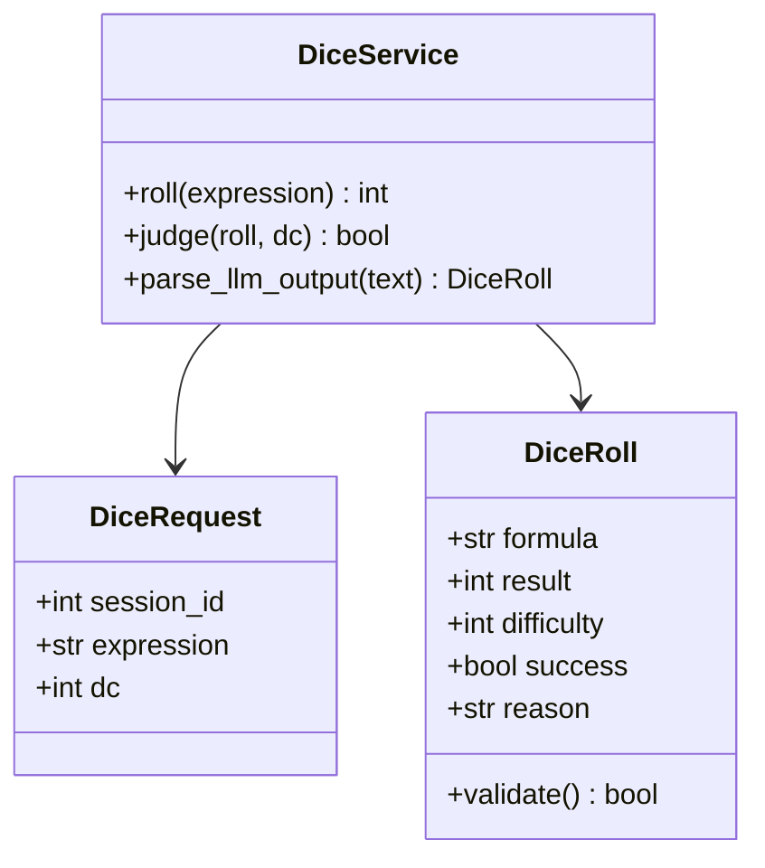
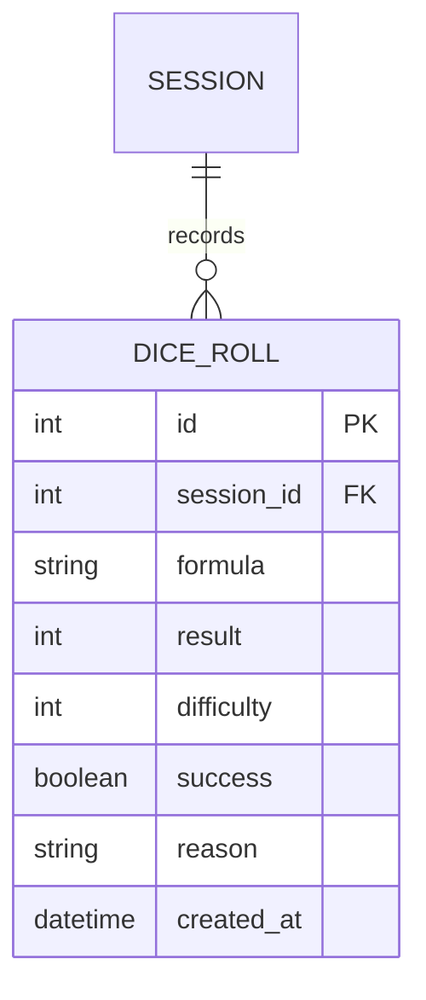
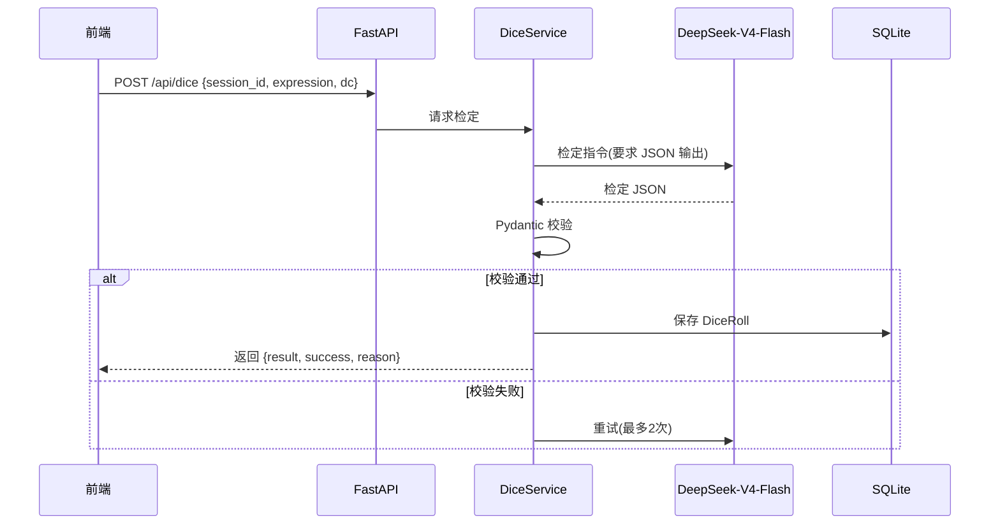
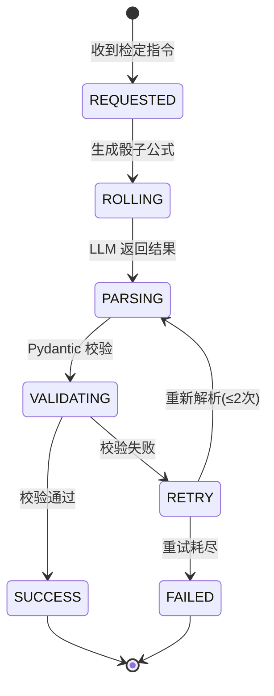

# US03 骰子检定判定

> 核心用户故事（含 6 图建模）｜ 优先级：P0 ｜ 故事点：5 ｜ 对应 Sprint 2

---

## Card（卡片）

- **用户角色（As a）**：跑团玩家
- **需求（I want）**：发起骰子检定（如"检定力量"）
- **价值（So that）**：系统用随机骰子 + 属性修正判定成功/失败，让剧情由"命运"决定

## Conversation（对话）

- **前置条件**：玩家已进入会话；角色具备属性值（力量/敏捷等）
- **故事描述**：玩家输入"检定力量对抗 DC 15"等指令，系统生成骰子公式（如 `d20+2`），调用 LLM 输出结构化检定结果，用 Pydantic 强校验，判定成功/失败并影响后续剧情分支
- **验收标准**：
  1. 检定结果结构化，字段包含：公式、数值、难度 DC、成败、理由
  2. Pydantic 校验非法时自动重试（最多 2 次）
  3. 检定结果被持久化并影响剧情

## Confirmation（Gherkin BDD）

```gherkin
Feature: 骰子检定判定
  Scenario: 玩家发起力量检定
    Given 玩家角色力量属性为 14
    When 玩家输入"检定力量对抗 DC 15"
    Then 系统掷出 d20+2 并得出结果
    And 结果包含数值、成败、理由
    And 判定结果被记录并影响剧情

  Scenario: 检定输出不符合契约
    Given 玩家发起检定
    When 大模型返回的检定结果格式不符合数据契约
    Then 系统自动重试解析，最多 2 次
    And 成功后返回结构化结果
    And 重试耗尽则返回错误提示
```

---

## 故事级 6 图

### 图 1：用例 / 边界图（Story Context & Scope）



### 图 2：组件 / 数据流图（Story Component / Data Flow）



### 图 3：领域类与数据契约图（Pydantic Schema）



### 图 4：数据实体关系 / 持久化模型（Story Data Entity）



### 图 5：端到端时序图（Story Sequence Diagram）



### 图 6：微观状态机与活动流程图（Story State Machine）


