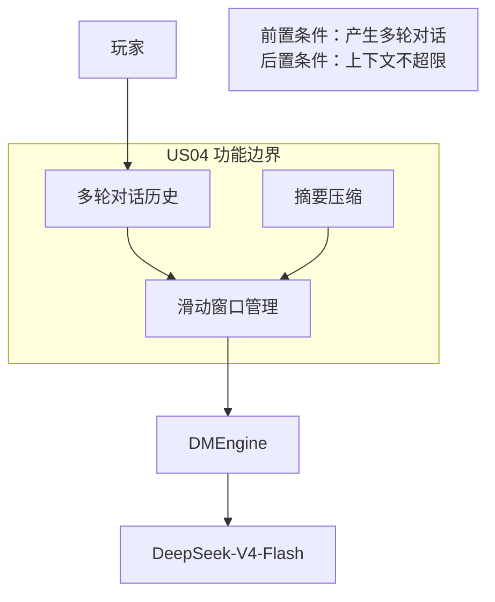
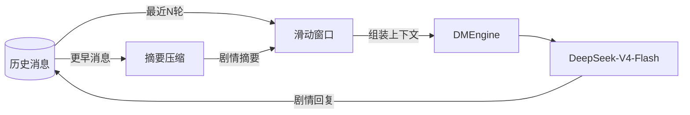
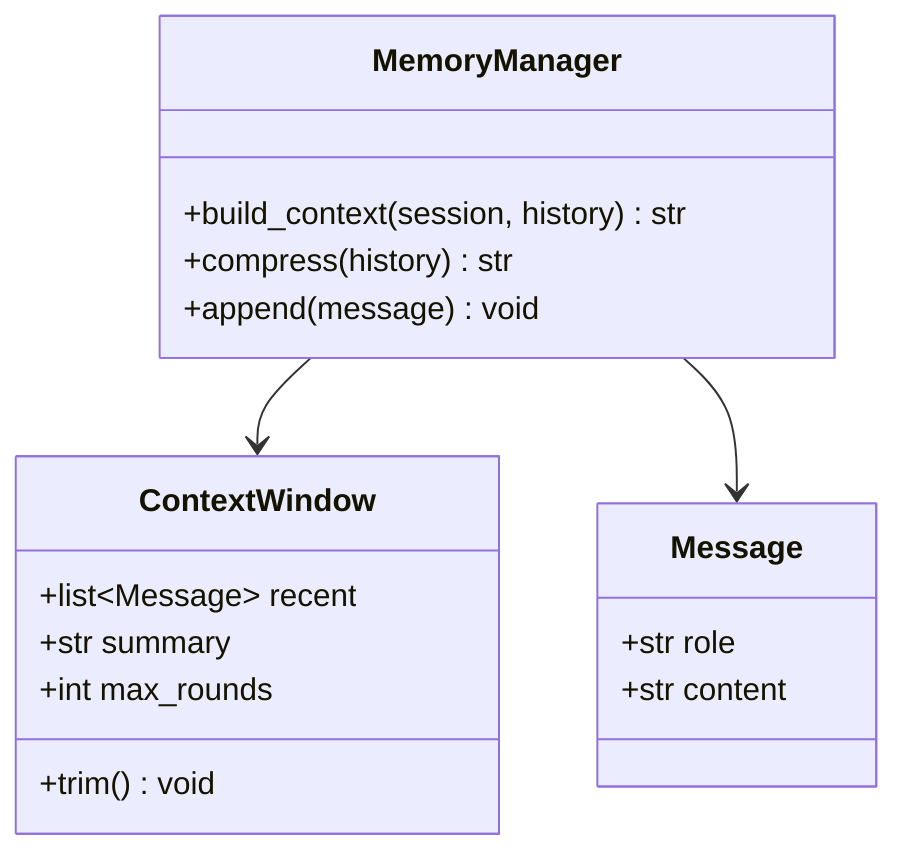
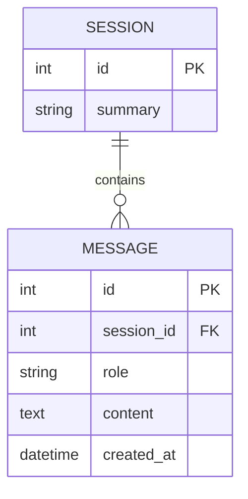
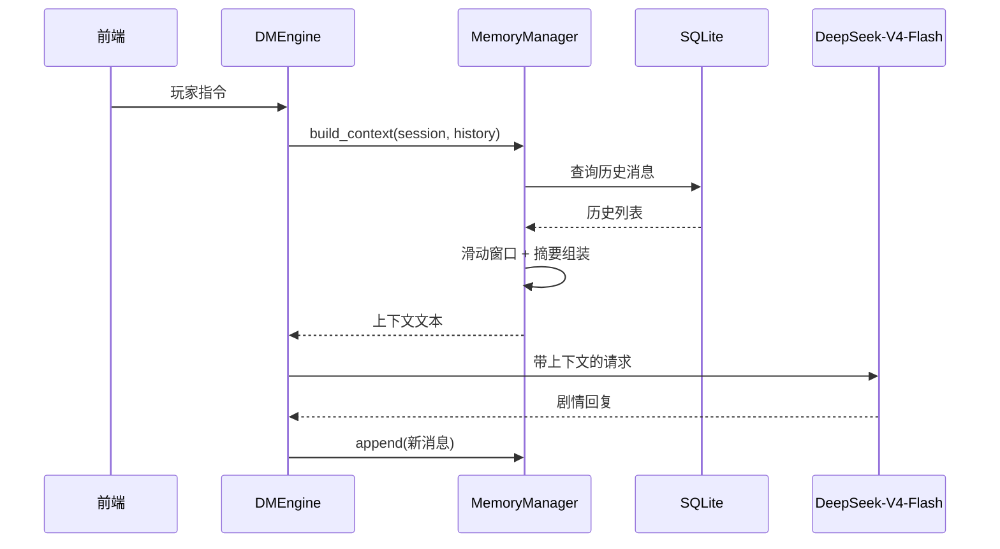
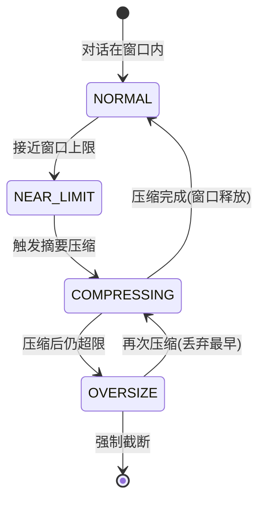

# US04 上下文记忆管理

优先级：P0 ｜ 故事点：3 ｜ 对应 Sprint 2

## Card

- **As a**：跑团玩家
- **I want**：长对话中 DM 记住之前的剧情
- **So that**：冒险连贯，不因对话过长而"失忆"

## Conversation

- 前置条件：玩家进入会话并产生多轮对话
- 描述：DM 引擎维护上下文：最近 N 轮用原文（滑动窗口），更早内容压缩为剧情摘要；上下文超限时自动摘要；关键状态（角色属性、物品）持久化
- 验收：超过 30 轮对话后仍能引用早期关键信息；上下文窗口不无限膨胀

## Confirmation

```gherkin
Feature: 上下文记忆管理
  Scenario: 长对话不失忆
    Given 玩家进行了超过 30 轮对话
    When 玩家提到第 5 轮捡到的"铁剑"
    Then DM 回应中引用该物品，剧情衔接正确
  Scenario: 上下文压缩
    Given 会话历史超过窗口上限
    When 系统触发摘要压缩
    Then 早期对话被压缩为摘要，关键信息保留
```

---

## 故事级 6 图

### 图 1：用例 / 边界图（Story Context & Scope）



### 图 2：组件 / 数据流图（Story Component / Data Flow）



### 图 3：领域类与数据契约图（Pydantic Schema）



### 图 4：数据实体关系 / 持久化模型（Story Data Entity）



### 图 5：端到端时序图（Story Sequence Diagram）



### 图 6：微观状态机与活动流程图（Story State Machine）


