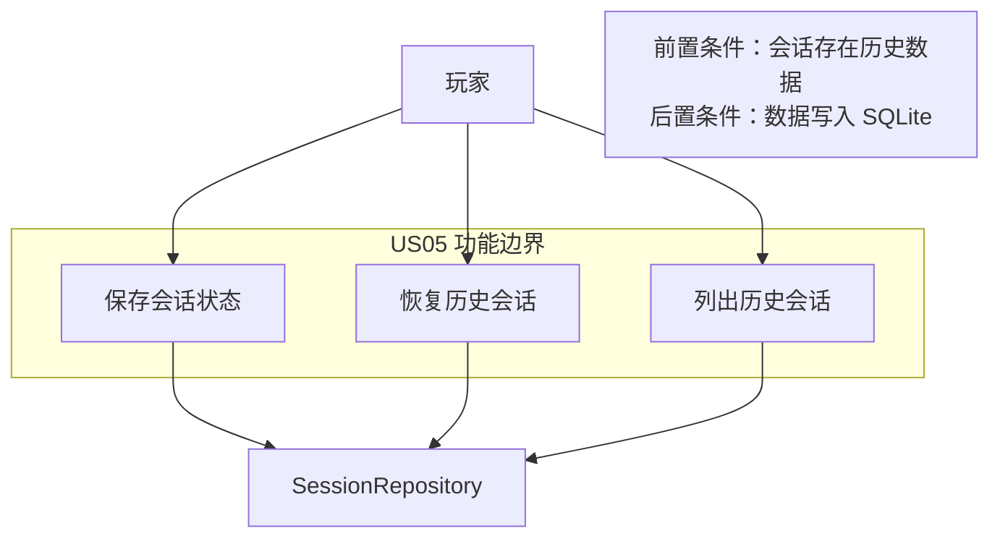
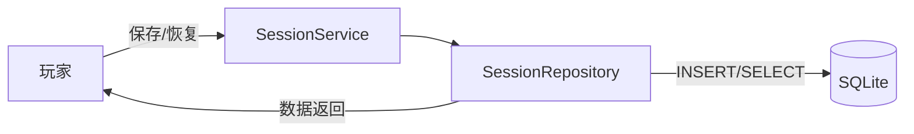
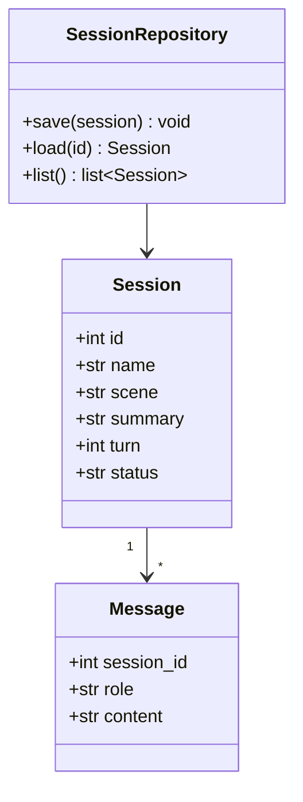
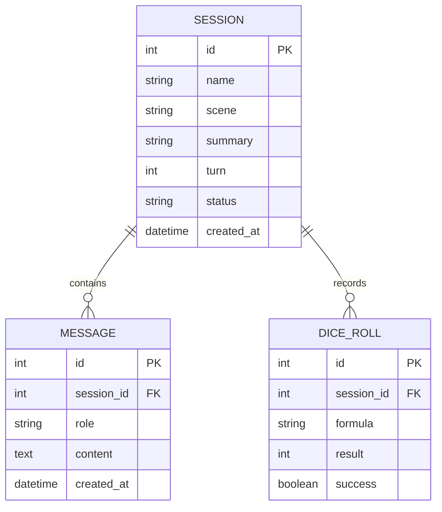
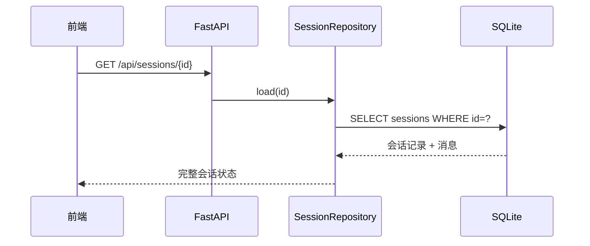
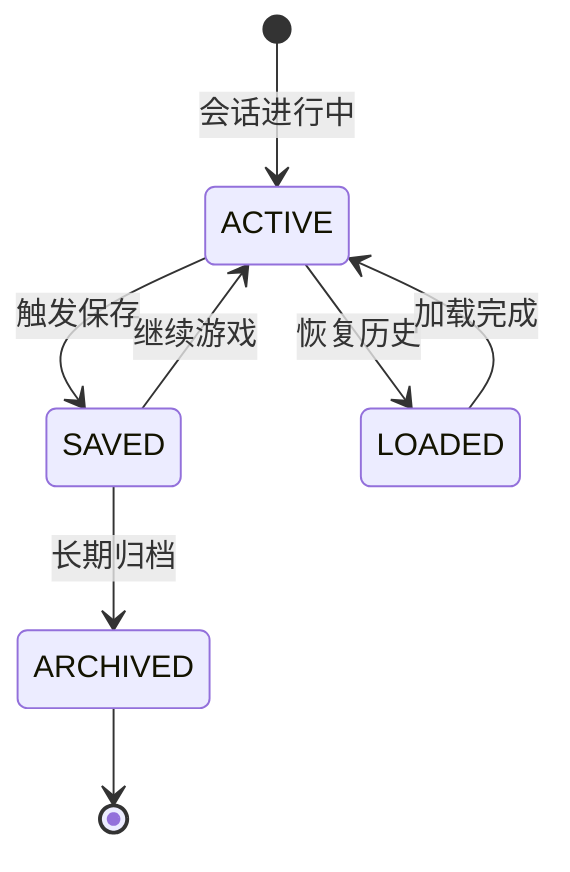

# US05 会话历史持久化与断点续玩

优先级：P0 ｜ 故事点：3 ｜ 对应 Sprint 2

## Card

- **As a**：跑团玩家
- **I want**：会话状态被保存
- **So that**：退出后能恢复继续玩

## Conversation

- 前置条件：玩家创建会话并产生历史
- 描述：会话、消息、角色、检定结果存入 SQLite；玩家可列出历史会话并恢复；重启服务后数据不丢失
- 验收：数据写入 SQLite；重启后能恢复会话；消息按时间顺序保存

## Confirmation

```gherkin
Feature: 会话持久化与断点续玩
  Scenario: 恢复会话
    Given 玩家有已保存的历史会话
    When 玩家重新进入会话
    Then 系统恢复剧情、角色属性与对话历史
  Scenario: 数据持久
    Given 服务重启
    When 玩家重新加载会话
    Then 历史数据完整可读
```

---

## 故事级 6 图

### 图 1：用例 / 边界图（Story Context & Scope）



### 图 2：组件 / 数据流图（Story Component / Data Flow）



### 图 3：领域类与数据契约图（Pydantic Schema）



### 图 4：数据实体关系 / 持久化模型（Story Data Entity）



### 图 5：端到端时序图（Story Sequence Diagram）



### 图 6：微观状态机与活动流程图（Story State Machine）


