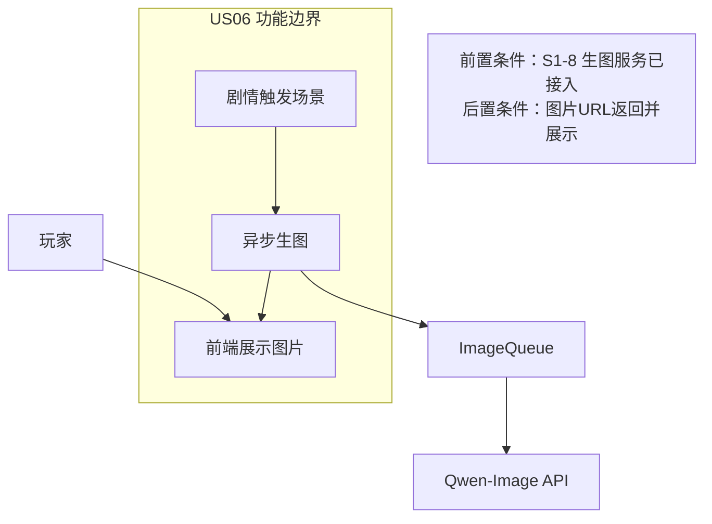
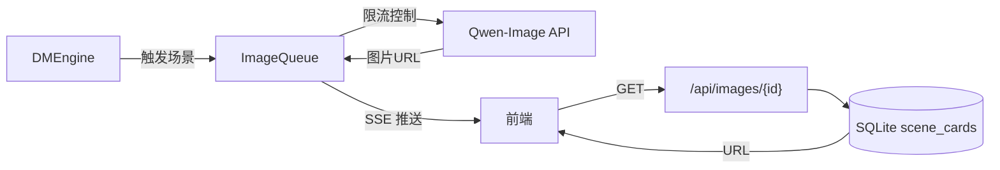
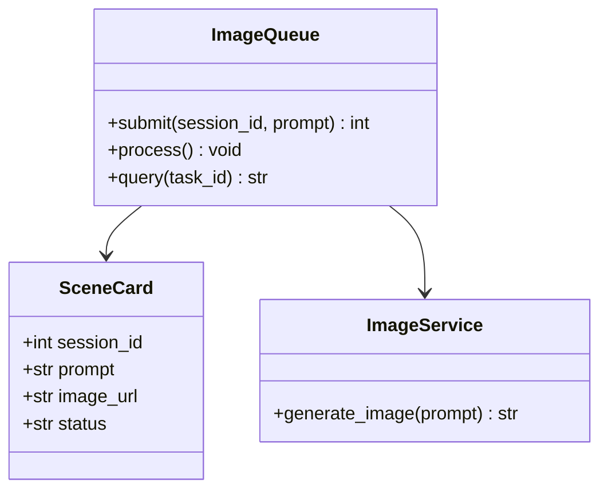
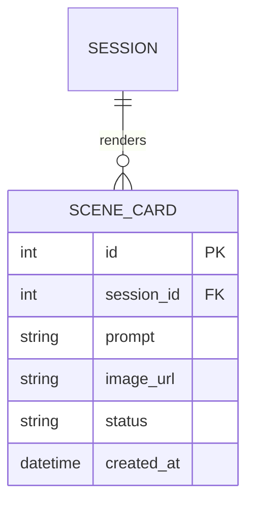
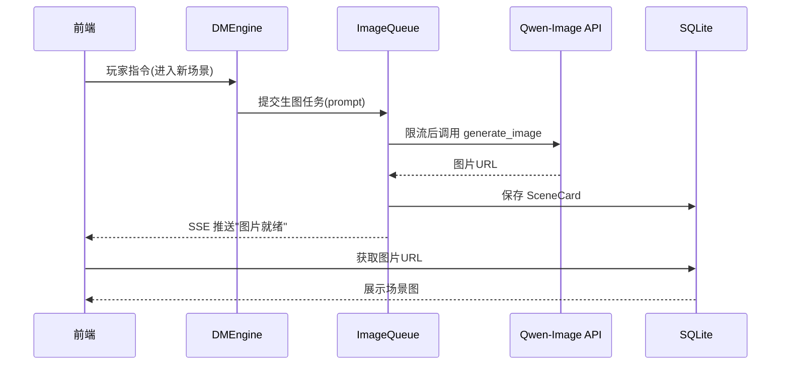
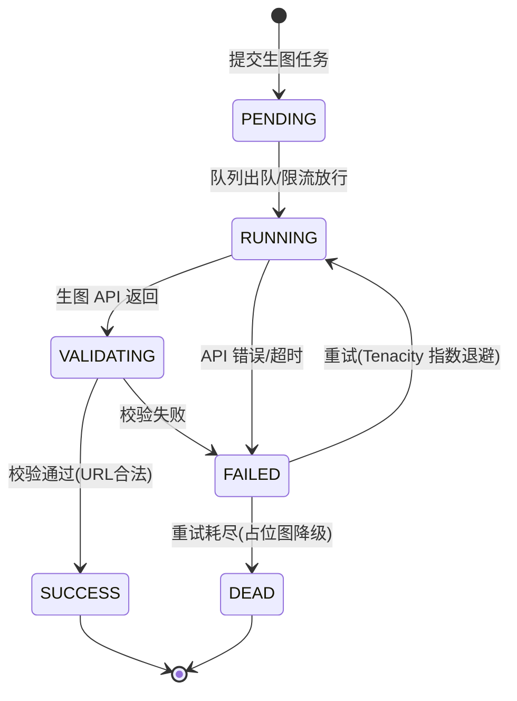

# US06 场景卡与角色卡生成

优先级：P1 ｜ 故事点：5 ｜ 对应 Sprint 3

## Card

- **As a**：跑团玩家
- **I want**：剧情推进时看到场景图和 NPC 画像
- **So that**：游戏更沉浸、有画面感

## Conversation

- 前置条件：玩家在会话中，剧情触发生图场景
- 描述：DM 回复中检测到"场景切换"或"NPC 登场"，后端生成生图 Prompt 并提交异步队列（限流 2 次/分）；生图完成后通过 SSE 通知前端展示；失败降级为占位图
- 验收：生图异步不阻塞对话；图片完成后自动显示；限流排队；失败降级

## Confirmation

```gherkin
Feature: 场景卡与角色卡生成
  Scenario: 触发场景生成
    Given 玩家进入新场景
    When DM 回复包含场景描述
    Then 系统异步生成场景图
    And 生成完成后自动展示，玩家无需等待
  Scenario: 生图失败
    Given 生图 API 调用失败
    When 重试后仍失败
    Then 显示占位图，不影响对话继续
```

---

## 故事级 6 图

### 图 1：用例 / 边界图（Story Context & Scope）



### 图 2：组件 / 数据流图（Story Component / Data Flow）



### 图 3：领域类与数据契约图（Pydantic Schema）



### 图 4：数据实体关系 / 持久化模型（Story Data Entity）



### 图 5：端到端时序图（Story Sequence Diagram）



### 图 6：微观状态机与活动流程图（Story State Machine）


